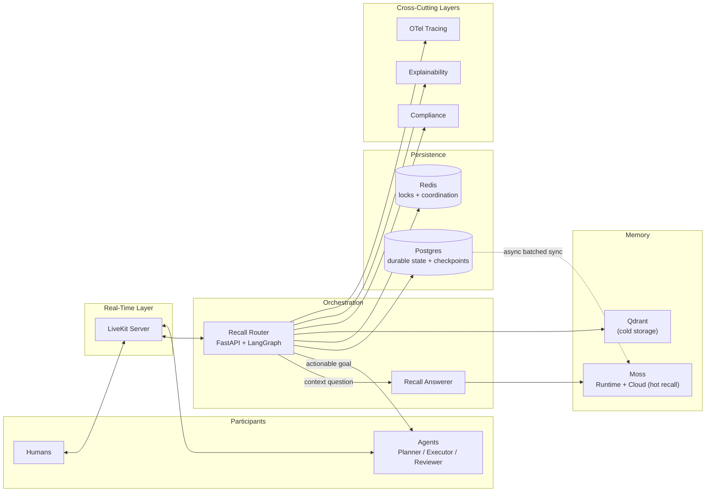

# Recall

> A shared, real-time workspace where humans and AI agents collaborate on long-running tasks — without losing context across sessions or agent handoffs.

Built for the **Multiplayer AI and Collaborative Agents** hackathon track.

---

## What is Recall?

Recall gives humans and a team of specialized AI agents — **Planner**, **Executor**, and **Reviewer** — a shared workspace instead of a disconnected chat window. Every message, decision, and task artifact is indexed into a fast semantic memory layer ([Moss](https://moss.dev)), so any participant — human or agent — can recall relevant history instantly instead of re-reading a growing transcript. Real-time sync is powered by [LiveKit](https://livekit.io), so every connected participant sees the same state live, with no polling.

## Key Features

- **Multiplayer, real-time collaboration** — LiveKit-backed presence and activity sync; every event is delivered exactly once per client via stable `event_id` deduplication.
- **Fast shared context** — Moss provides sub-10ms-target semantic recall, benchmarked live against a Qdrant cold-storage path rather than assumed.
- **Intelligent routing** — a lightweight classifier distinguishes *context/recall questions* (answered directly from Moss, bypassing the agent pipeline) from *actionable goals* (routed through the full Planner → Executor → Reviewer flow).
- **Reliable escalation** — an empty Planner output escalates to a human immediately; a task that fails Reviewer validation three times escalates automatically.
- **Web-capable agents, safely scoped** — the Executor can browse via Playwright, restricted to a domain allowlist, and can search the web via the Serper API.
- **Decision explainability** — every agent decision is logged with a structured `reasoning` field, surfaced through a "Why?" affordance in the activity thread.
- **Data rights, built in** — a dedicated compliance layer supports workspace data erasure across both Postgres and the Moss index.
- **Cost-aware by design** — retrieval is on-demand only (never polled or auto-triggered), and the benchmark panel is manually triggered and cached to respect metered API usage.
- **12-factor aligned** — environment-based config, a stateless orchestrator (all task state is Postgres-checkpointed via LangGraph), and disposable containers.

## Architecture



## Tech Stack

| Layer | Technology |
|---|---|
| Frontend | Next.js 14 (App Router), React, CSS |
| Real-time | LiveKit — data channels, presence, reconnection |
| Orchestration | FastAPI, LangGraph, Python |
| LLM | Groq |
| Fast retrieval | Moss (Runtime sidecar + Moss Cloud) |
| Cold storage | Qdrant |
| Durable state | PostgreSQL |
| Coordination | Redis |
| Tools | Playwright (domain-allowlisted), Serper API |
| Observability | OpenTelemetry, Honeycomb/Jaeger |

## How It Works

1. A human or agent sends a message or goal into a workspace.
2. The **Recall Router** classifies it: a context/history question routes straight to the **Recall Answerer**, which queries Moss (scoped by `workspace_id`) and returns a grounded answer — no planning required.
3. An actionable goal instead enters the **Planner → Executor → Reviewer** loop. The Planner breaks it into subtasks; the Executor carries them out (including web browsing/search where needed); the Reviewer validates the result.
4. If the Planner returns no subtasks, or the Reviewer rejects the result three times, the task escalates to a human.
5. Every step is broadcast live via LiveKit to all connected participants, logged to Postgres (with a `reasoning` field for explainability), and asynchronously indexed into Moss for future recall.

## Getting Started

### Prerequisites

- Docker + Docker Compose
- Node.js 18+
- Python 3.11+
- A [Moss Cloud](https://moss.dev) project (project ID + key)
- A [Groq](https://groq.com) API key
- A [LiveKit Cloud](https://livekit.io) project (URL + API key/secret)

### 1. Clone and configure

```bash
git clone https://github.com/Atharva14518/semantic-moss.git
cd semantic-moss/recall
cp .env.example .env
# Fill in: MOSS_PROJECT_ID, MOSS_PROJECT_KEY, GROQ_API_KEY,
#          LIVEKIT_URL, LIVEKIT_API_KEY, LIVEKIT_API_SECRET,
#          DATABASE_URL, REDIS_URL, QDRANT_URL
```

### 2. Start the backend stack

```bash
docker compose up
```

Brings up Postgres, Redis, Qdrant, and the FastAPI backend (with the Moss Runtime sidecar).

### 3. Start the frontend

```bash
cd frontend
npm install
npm run dev
```

### 4. Try it out

Open the app in two browser tabs on the same workspace to see real-time multiplayer sync in action.

## API Reference

| Method | Endpoint | Description |
|---|---|---|
| `POST` | `/v1/workspace/{id}/task` | Submit a goal — automatically routed to the agent pipeline or answered directly, depending on intent |
| `GET` | `/v1/workspace/{id}/recall` | Direct context/history query, bypassing the agent pipeline |
| `GET` | `/v1/workspace/{id}/token` | Fetch a short-lived, scoped LiveKit access token |
| `DELETE` | `/v1/workspace/{id}/data` | Erase a workspace's data from Postgres and Moss (right to erasure) |
| `POST` | `/v1/benchmark` | Trigger a manual, cached latency comparison between Moss and Qdrant |

## Project Structure

```text
semantic-moss/
├── README.md
├── Product-Requirements-Document-PRD-Multiplayer-AI-Collaborati (1).md
└── recall/
    ├── backend/
    │   ├── main.py            # FastAPI app entrypoint
    │   ├── config.py          # Environment-based settings
    │   ├── moss_client.py     # Moss SDK wrapper
    │   ├── realtime.py        # LiveKit event publishing
    │   ├── db/schema.sql      # Postgres schema
    │   ├── agents/
    │   │   ├── state.py       # LangGraph state definition
    │   │   ├── graph.py       # Graph topology + Postgres checkpointing
    │   │   ├── nodes.py       # Planner / Executor / Reviewer / Escalate / Recall Answerer
    │   │   └── llm.py         # Groq client factory
    │   └── routers/           # Task, realtime, benchmark, and security endpoints
    ├── frontend/
    │   └── app/               # Next.js App Router workspace UI
    └── docker-compose.yml
```

## Design

The UI uses a deliberately restrained dark theme: amber as the single bold signal color, a muted moss green for agent identity, and no purple or glassmorphism — see the `recall/frontend` design tokens for the full palette.

## Known Limitations (MVP)

Being upfront about what's simplified for the hackathon build:

- **Tenant isolation is logical, not physical.** All workspaces share a single Moss index, isolated via `workspace_id` metadata filtering plus an orchestrator-side authorization check — not separate per-tenant Moss projects. This is a deliberate trade-off driven by trial-tier budget/index limits, not an oversight.
- **Retention policy is documented, not fully enforced.** A 30-day retention policy is defined for workspace history; automated purging isn't built yet — only the on-demand erasure endpoint is.
- **Sync is batched, not event-driven.** The Postgres → Moss sync worker runs on batched polling (Celery/Redis), not change-data-capture.

## License

No license has been specified yet — add one (MIT is a common choice for hackathon projects) before wider distribution.
